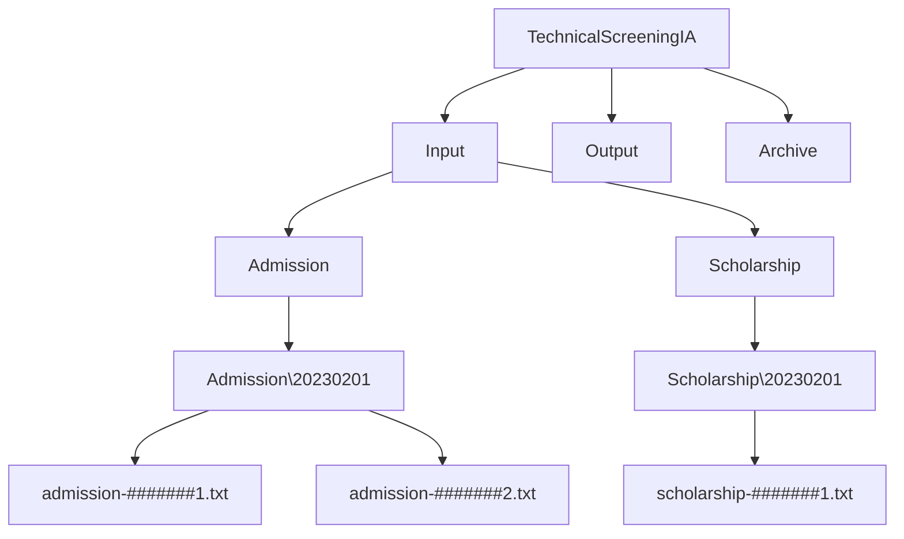
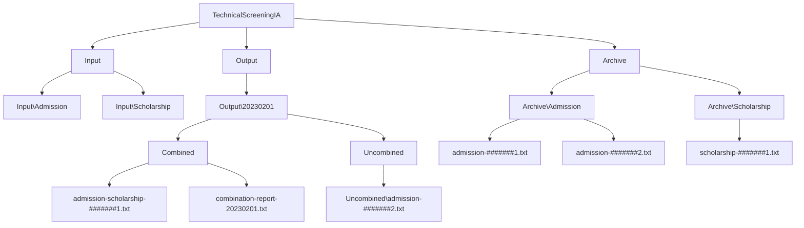

# Technical Screening For IA

[How-To-Use](https://github.com/Aecef/TechnicalScreeningIA#how-to-use)  
[Folder Format](https://github.com/Aecef/TechnicalScreeningIA#folder-format)  
[Estimation](https://github.com/Aecef/TechnicalScreeningIA#estimation)  
[Assumptions](https://github.com/Aecef/TechnicalScreeningIA#assumptions)  
[Problems](https://github.com/Aecef/TechnicalScreeningIA#problems)  
[Other](https://github.com/Aecef/TechnicalScreeningIA#other)  
[Comments On Code](https://github.com/Aecef/TechnicalScreeningIA#comments-on-code)  

## How To Use

Here are two different options when running this program

### Through The Console

With a console open in `TechnicalScreeningIA\TechnicalScreeningIA\bin\Debug\net7.0\` :  

Run the command `.\TechnicalScreeningIA "[PATH]"\CombinedLetters`

The Console will print the contents of file that contains the list of Student Ids that had combined files.

### Moving the 'CombinedLetters' Directory  

Move the `CombinedLetters` folder into the same dir as the .exe :  

`TechnicalScreeningIA\TechnicalScreeningIA\bin\Debug\net7.0\` 

Double click `TechnicalScreeningIA.exe` to run the program.

The program will run and generate the files required.  
> **Warning**
> Currently there is no UI to indicate to the user what has happened.

## Folder Format

### Before Running `TechnicalScreeningIA.exe`

### After Running `TechnicalScreeningIA.exe`

## Estimation

I originally estimated it would take around 4-4.5 hours.  
Although split up, my actual work time was around 5-6 hours.  
The discrepency seemed to stem from the fact that I havent done too much work creating console applications in C# and needed to look up documentation. Since I wasn't completely familiar with the libraries I also ran into some errors that took some manual testing for me to understand and fix.  

## Assumptions

Output File does not need to keep track of the date when the letters come in.  
- Upon further reading, it may be helpful to put the files in a dated folder to help keep reports near the changed files.  
  
There will be more admission letters than scholarship letters.  
Will assume the user can use the console.  
All of the files will be in correct format   
This program will always be used in Iowa (CST)
This console app will be run everyday at 10AM

## Problems

I ran into some problems when attempting to move the directories into the 'Archive'. Such as the execption `DirectoryNotFoundException`. To solve issues like that I tend to initially find the line of code that triggered the error then try to understand whether or not the new code I recently added caused this or if I was touching untested code. In this case, my recent code seemed to be the cause, so I used `Console.WriteLine()` to print the paths string near the use of the move call. From there, it was pretty simple to fix since I knew the error and could analyze the path to see where I was actually pointing to.

## Other

### 1. What will happen if a person accidentally runs the Console app before or after the scheduled time?  
### 2. What will happen if the Console app wasn’t run previous day, and it runs today?

#### If it is before/after the scheduled DAY

If today(2-1-2023) it is run twice, which is once more before the next day, the program will attempt to find a folde named `20230201` which will no longer exist since that file has been archived. The progam will then end. If it is ran after the day, then the program will skip the previous day's folder.

#### If it is before/after the scheduled TIME (10:00AM)

This wouldn't seem to affect the program unless it is used a different time zone than expected.

## Comments On Code

I altered the suggested code `CombineTwoLetters(string inputFile1, string inputFile2, string resultFile)` to  
`CombineTwoLetters(string inputFile1, string inputFile2, string dateFormatted)`  

I made this change because I create the `resultFile` within the function and `dateFormatted` is the day in the format yyyyMMdd which helps me create a file path for the output files.

There was no mention in the description that the `Output` folder needed to contain the uncombined files. However, since this made to save mailing fees
I figured that we would also still want the remaining files so my output creates a `Combined` and `Uncombined` directory for each day. Combined contains the requested file(s) and report(s).

 
