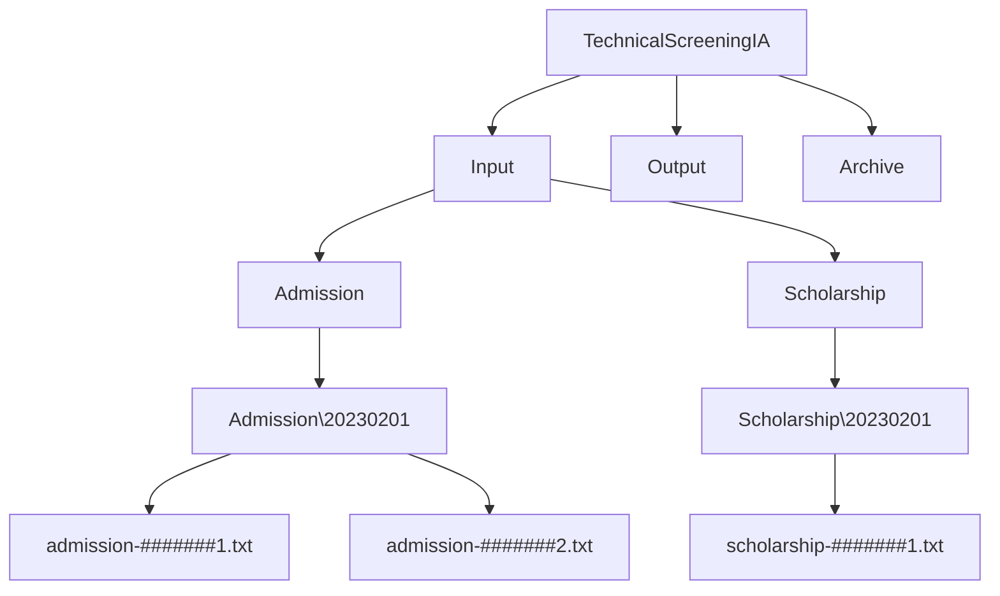
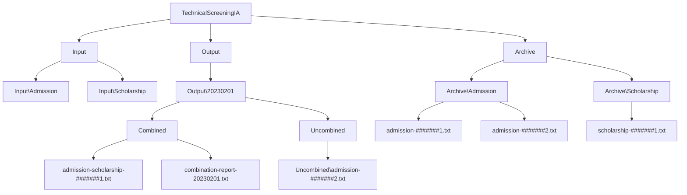

# Technical Screening For IA

[How-To-Use](https://github.com/Aecef/TechnicalScreeningIA#how-to-use)

## How To Use

Here are two different options when running this program

### Through The Console

With a console open in `TechnicalScreeningIA\TechnicalScreeningIA\bin\Debug\net7.0\` :  

Run the command `.\TechnicalScreeningIA "[PATH]"\CombinedLetters`

The Console will print the contents of file that contains the list of Student Ids that had combined files.

### Moving the 'CombinedLetters' Directory  

Move the `CombinedLetters` folder into the same dir as the .exe :  

`TechnicalScreeningIA\TechnicalScreeningIA\bin\Debug\net7.0\` 

Double click `TechnicalScreeningIA.exe` to run the program.

The program will run and generate the files required.  
> **Warning**
> Currently there is no UI to indicate to the user what has happened.

## Folder Format

### Before Running `TechnicalScreeningIA.exe`

### After Running `TechnicalScreeningIA.exe`

 
